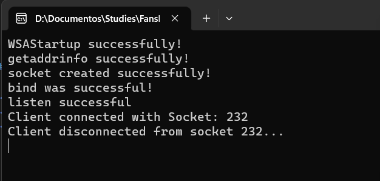
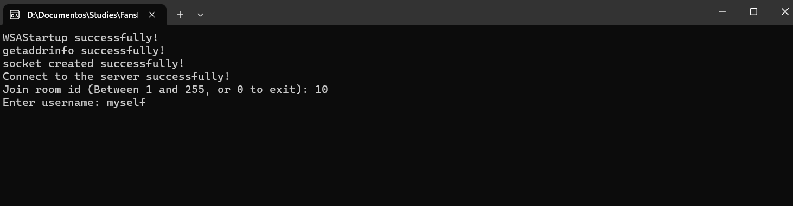
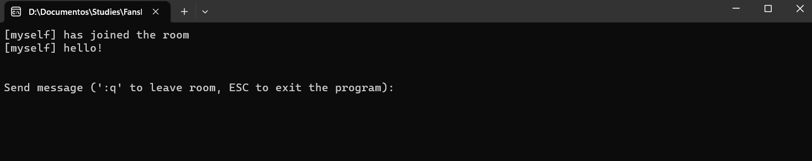

# Project 1 - Chat program

## About

Project 1 for "Network programming" class. A chat program to send messages through network using TCP protocol.

## Requirements

- Visual studio 2022
- Winsock2

## How to run

1. Extract all libs that are zipped in the "Extern/lib" folder
2. Open the solution file in Visual Studio 2022.
3. First run:
    - Build the "TCPLib" project first
    - Build the "ChatServer" and the "ChatClient" projects
    - Open the build folder "x64/$(Configuration)" run ChatServer.exe
    - Run ChatClient.exe

## How to use

- When the server is running, execute the ChatClient.exe
- On the client program you just need to inform the room id you would like to connect and the username you'll use
- After connecting to the room, you can send any messages or leave the room by sending ":q"

### Screenshots

